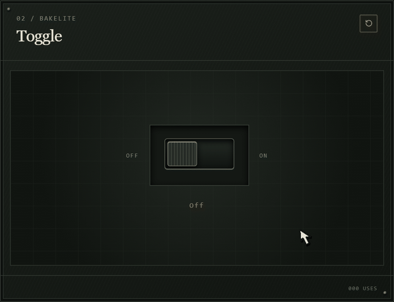
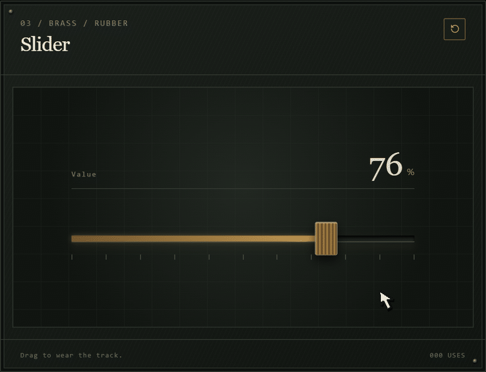
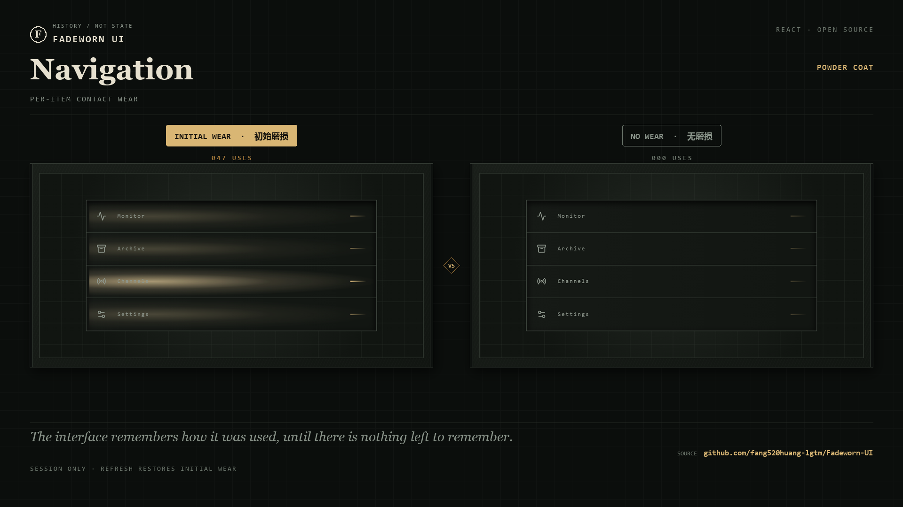
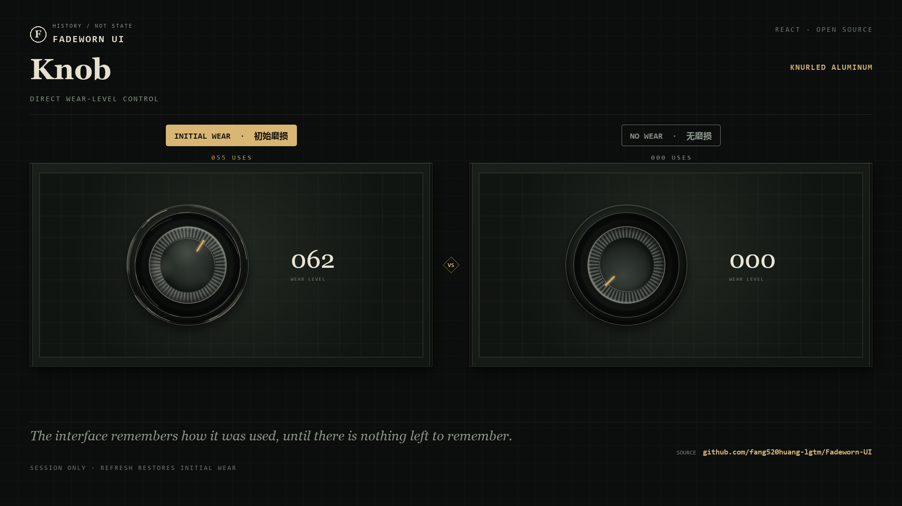

# Fadeworn UI

*The interface remembers how it was used, until there is nothing left to remember.*

**Live demo: [fang520huang-lgtm.github.io/Fadeworn-UI](https://fang520huang-lgtm.github.io/Fadeworn-UI/)**

Fadeworn UI explores interfaces that retain a visible history of interaction. Clicks, drags, selections, typing, and scrolling change each control through material-specific wear rather than randomly applied distress.

<p></p>





The showcase starts with a curated wear preset. Wear is stored only for the current browser session: refreshing restores the preset, while **No Wear** clears every surface for comparison.

## What this repository provides

- Ten working, accessible examples of wear-aware controls.
- A React hook that records usage, positional traces, and glyph-level wear.
- CSS treatments for painted steel, brass, rubber, paper, enamel, and machined surfaces.
- A complete Next.js showcase and a static export workflow for GitHub Pages.

This repository is a reference implementation, not a published npm package. You do not need to clone it merely to view the project; use the live demo for that. Clone or fork it when you want to study the implementation, adapt the wear system, or build on the showcase.

## Use it in your project

The code currently targets Next.js 16, React 19, TypeScript, Tailwind CSS 4, and Radix UI. Because the specimens share a state model and a visual system, they are provided as source rather than as isolated drop-in components.

For the quickest integration:

1. Copy `hooks/use-wear-system.ts` into your project.
2. Copy the specimen you want from `components/wear/`, together with `specimen-frame.tsx`.
3. Copy the UI primitives imported by that specimen from `components/ui/`, plus `lib/utils.ts`.
4. Copy the corresponding material and component styles from `app/globals.css`.
5. Call `useWearSystem()` in a client component and pass the relevant record and mutation functions to the specimen.

For example, the button specimen is connected like this:

```tsx
"use client";

import { WearButtonSpecimen } from "@/components/wear/action-specimens";
import { useWearSystem } from "@/hooks/use-wear-system";

export function WearButtonExample() {
  const { wearState, markUse, resetOne } = useWearSystem();

  return (
    <WearButtonSpecimen
      record={wearState.button}
      markUse={markUse}
      onReset={() => resetOne("button")}
    />
  );
}
```

See [Using Fadeworn UI in another project](docs/USING-IN-YOUR-PROJECT.md) for dependencies, file-by-file guidance, and instructions for creating a custom wear-aware control.

## Run the showcase locally

Node.js 22.13 or newer is required.

```bash
git clone https://github.com/fang520huang-lgtm/Fadeworn-UI.git
cd Fadeworn-UI
npm install
npm run dev
```

Open [http://localhost:5173](http://localhost:5173). On Windows, `Open Fadeworn UI.html` opens the same address after the development server is running.

## Component reference

| # | Component | Material | Recorded interaction |
| --- | --- | --- | --- |
| 01 | [Button](docs/COMPONENTS.md#01--button) | Painted steel | Press count and uniform surface fade |
| 02 | [Toggle](docs/COMPONENTS.md#02--toggle) | Bakelite | Resting-side friction |
| 03 | [Slider](docs/COMPONENTS.md#03--slider) | Brass / rubber | Travel-path friction |
| 04 | [Input](docs/COMPONENTS.md#04--input) | Anodized alloy | Glyph-position abrasion |
| 05 | [Tabs](docs/COMPONENTS.md#05--tabs) | Printed ABS | Per-tab selection frequency |
| 06 | [Navigation](docs/COMPONENTS.md#06--navigation) | Powder coat | Per-item contact wear |
| 07 | [Card](docs/COMPONENTS.md#07--card) | Archival paper | Fiber wear and oxidation |
| 08 | [Checkbox / Radio](docs/COMPONENTS.md#08--checkbox--radio) | Enameled metal | Selection activity |
| 09 | [Scrollbar](docs/COMPONENTS.md#09--scrollbar) | Machined rail | Scroll-path memory |
| 10 | [Knob](docs/COMPONENTS.md#10--knob) | Knurled aluminum | Direct wear-level control |

[docs/COMPONENTS.md](docs/COMPONENTS.md) lists each component's source file, props, interaction model, and initial preset.

## How the wear system works

Each specimen owns a `WearRecord` containing a usage count, an overall wear level, a last-used timestamp, and interaction-specific traces. The system exposes three main write paths:

- `markUse` records uniform wear.
- `markTrace` records wear at a normalized position.
- `markInputGlyph` records text wear across measured glyph ranges.

`getWearLevelForDisplay` normalizes the different histories for the inspector without changing how the controls render. Wear never represents a disabled, error, or loading state, and it never reduces usability.

Read [docs/WEAR-SYSTEM.md](docs/WEAR-SYSTEM.md) for the data model, presets, rendering properties, and extension points.

## Project structure

```text
app/
  page.tsx                  Showcase composition and page content
  globals.css               Layout, materials, and wear rendering
components/
  wear/                     Wear-aware specimen implementations
  ui/                       Shared shadcn/ui and Radix UI primitives
hooks/
  use-wear-system.ts        Wear state, interaction mapping, and presets
lib/
  utils.ts                  Shared class-name helper
docs/
  COMPONENTS.md             Component reference
  WEAR-SYSTEM.md            State and rendering model
  USING-IN-YOUR-PROJECT.md  Source-integration guide
  DEPLOYMENT.md             Static deployment guide
```

## Development

Run both checks before submitting a change:

```bash
npm run lint
npm run build
```

To verify the same static output used by GitHub Pages:

```bash
npm run build:static
npx serve out
```

## Deployment

The included GitHub Actions workflow publishes the static export to GitHub Pages whenever `master` or `main` is updated. For another static host, use `npm run build:static` as the build command and `out` as the output directory.

See [docs/DEPLOYMENT.md](docs/DEPLOYMENT.md) for GitHub Pages, Cloudflare Pages, and custom-domain guidance.

## Contributing

Contributions are welcome. Read [CONTRIBUTING.md](CONTRIBUTING.md) before opening a pull request.

## License

[MIT](LICENSE) © [@fang520huang-lgtm](https://github.com/fang520huang-lgtm)
